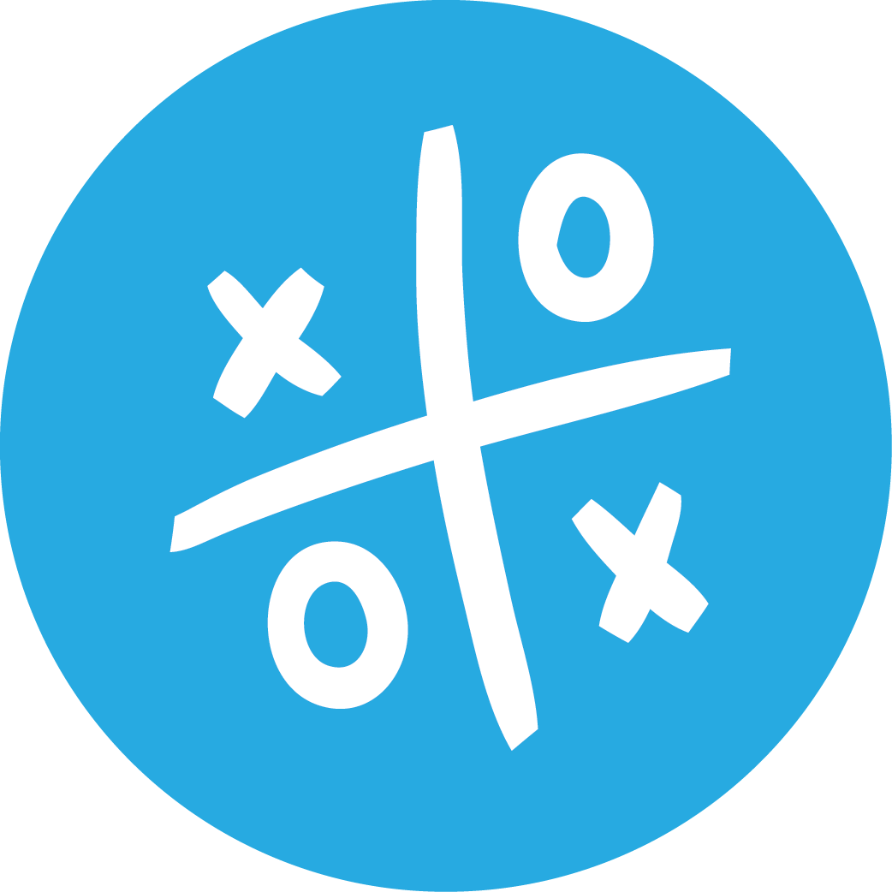

# iox.io

<br><br>

An X-O game where players need to align 5 successive symbols to score points.

## Game Description
iox.io is a web-based game where two players take turns marking spaces in a grid. The objective is to be the first to align 5 successive symbols (either X or O) horizontally, vertically, or diagonally.

## Technologies Used
- HTML
- CSS
- JavaScript
- Bootstrap Icons

## How to install

First, clone the repository :

```md
    git clone https://github.com/othman4dev/iox.io.git
```
Get to the repository folder :

```md
    cd iox.io
```
Open folder in Visual Studio Code :

```md
    code .
```
Now you need to start your [Live server](ritwickdey.LiveServer) extention or [Live preview](microsoft.LivePreview).

### Or simply navigate to [The game online](https://othman4dev.github.io/iox.io/) .

## How to Play
1. The game is played on a grid 20x20.
2. Players take turns to place their symbol (X or O) in an empty cell.
3. The first player to align 5 successive symbols in any direction (horizontal, vertical, or diagonal) wins the game.
4. If all cells are filled and no player has aligned 5 symbols, the game ends in a draw.

## Links
- [Play the Game](https://othman4dev.github.io/iox.io/)
- [GitHub Repository](https://github.com/othman4dev/iox.io)
- [Developer's Portfolio](http://otmankharbouch.live)

